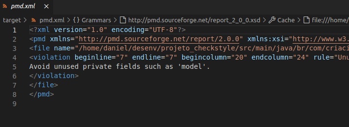

[](https://github.com/danielso2007/testeStandardVersion/actions/workflows/maven-publish.yml)


[](https://github.com/danielso2007/testeStandardVersion/pulls)
[](https://github.com/danielso2007/testeStandardVersion/issues?q=is%3Aopen+is%3Aissue)

[](https://github.com/danielso2007/testeStandardVersion/pulls)


[](https://github.com/danielso2007/testeStandardVersion/archive/main.zip)
[](https://conventionalcommits.org)

<p align="center">
  <h3 align="center">Padrões de projeto criacionais</h3>

  <p align="center">
    O objetivo desse projeto é apresentar as melhores ferramentas para ajudar programadores a seguir o melhro padrão de um bom desenvolvimento de software.
    <br />
    <a href="https://github.com/danielso2007/testeStandardVersion"><strong>Explore the docs »</strong></a>
    <br />
    <br />
    <a href="https://github.com/danielso2007/testeStandardVersion">View Demo</a>
    ·
    <a href="https://github.com/danielso2007/testeStandardVersion/issues">Report Bug</a>
    ·
    <a href="https://github.com/danielso2007/testeStandardVersion/issues">Request Feature</a>
  </p>
</p>


<!-- TABLE OF CONTENTS -->
<details open="open">
  <summary>Table of Contents</summary>
  <ol>
    <li>
      <a href="#checkstyle">Checkstyle</a>
      <ul>
        <li><a href="#características">Características</a></li>
        <li><a href="#o-arquivo-de-configuração">O arquivo de configuração</a></li>
        <li><a href="#executando-a-verificação-de-estilo-de-código">Executando a verificação de estilo de código</a></li>
      </ul>
    </li>
    <li>
      <a href="#configuração-de-formatação-e-clean-up-para-sts-e-eclipse">Configuração de formatação e clean up para STS e Eclipse</a>
    </li>
    <li>
      <a href="#pmd---analisador-de-código-fonte-estático">PMD - Analisador de código fonte estático</a>
      <ul>
        <li><a href="#executando-a-verificação-da-análise-estática-do-código">Executando a verificação da análise estática do código</a></li>
        <ul>
            <li><a href="#resultado-em-xml">Resultado em XML</a></li>
            <li><a href="#resultado-em-html">Resultado em HTML</a></li>
        </ul>
      </ul>
    </li>
    <li>
      <a href="#cobertura-de-código">Cobertura de código</a>
      <ul>
        <li><a href="#biblioteca-de-cobertura-de-código-java-jaCoCo">Biblioteca de Cobertura de Código Java JaCoCo</a></li>
        <li><a href="#executando-a-cobertura-de-código">Executando a cobertura de código</a></li>
      </ul>
    </li>
  </ol>
</details>

## Checkstyle

Checkstyle é uma ferramenta de desenvolvimento para ajudar programadores a escrever código Java que segue um padrão de codificação. Ele automatiza o processo de verificação do código Java para poupar os humanos dessa tarefa chata (mas importante). Isso o torna ideal para projetos que desejam impor um padrão de codificação.

Checkstyle é altamente configurável e pode ser feito para suportar quase qualquer padrão de codificação.

[Documentação do checkstyle, aqui.](https://checkstyle.sourceforge.io/)

### Características

Checkstyle pode verificar muitos aspectos do seu código-fonte. Ele pode encontrar problemas de design de classe, problemas de design de método. Ele também tem a capacidade de verificar o layout do código e problemas de formatação.

Para obter uma lista detalhada de checks disponíveis, consulte a página [checks](https://checkstyle.sourceforge.io/checks.html).

### O arquivo de configuração

O arquivo de configuração está nas pasta `config/checkstyle.xml`. A maior parte das configurções segue o padrão [Google Java Style](https://checkstyle.sourceforge.io/styleguides/google-java-style-20180523/javaguide.html).

### Executando a verificação de estilo de código

Executar no terminal o comando:

```shell
mvn clean package checkstyle:check
```
Neste momento, no terminal, será exibido as informações caso ocorra alguma violação. Também, na pasta `/target`, o resultado em `checkstyle-result.xml`.

## Configuração de formatação e clean up para STS e Eclipse

Na pasta `clean_up_formatter` há dois arquivos de formatação que podem ser usados no Eclipse e STS para padronizar todas as formatações de todas as classes do seu projeto, ganhando muito tempo nas correções dos estilos do código.

## PMD - Analisador de código fonte estático

PMD é um analisador de código fonte estático. Ele encontra falhas de programação comuns, como variáveis ​​não utilizadas, blocos catch vazios, criação desnecessária de objetos e assim por diante. Ele se preocupa principalmente com Java e Apex, mas suporta seis outras linguagens.

O PMD apresenta muitas verificações internas (no jargão do PMD, rules), que são documentadas para cada idioma em nossas [referências de regras](https://pmd.sourceforge.io/pmd-6.49.0/#shuffle-panel-rule-references). Também oferecemos suporte a uma API extensa para [escrever suas próprias regras](https://pmd.sourceforge.io/pmd-6.49.0/#shuffle-panel-writing-rules), que você pode fazer em Java ou como uma consulta XPath independente.

 PMD é mais útil quando integrado ao seu processo de compilação . Ele pode então ser usado como um portão de qualidade, para impor um padrão de codificação para sua base de código. Entre outras coisas, o PMD pode ser executado:

 - Como uma [meta do Maven](https://pmd.sourceforge.io/pmd-6.49.0/pmd_userdocs_tools_maven.html)

### Executando a verificação da análise estática do código

 Executar no terminal o comando:

```shell
mvn clean package pmd:check
```
Neste momento, no terminal, será exibido as informações caso ocorra alguma violação. Também, na pasta `/target`, o resultado em `/site/pmd.html` e nas `pmd.xml`.

#### Resultado em XML

<p align="center">
    
</p>

#### Resultado em HTML

<p align="center">
    
</p>

## Cobertura de código

[EclEmma](https://www.eclemma.org/index.html) é uma ferramenta gratuita de cobertura de código Java. Ele traz a análise de cobertura de código diretamente para o ambiente de trabalho do Eclipse:

- **Ciclo de desenvolvimento/teste rápido**: Lançamentos de dentro do ambiente de trabalho, como execuções de teste JUnit, podem ser analisados diretamente para cobertura de código.
- **Análise de cobertura avançada**: Os resultados da cobertura são imediatamente resumidos e destacados nos editores de código-fonte Java.
- **Não invasivo**: EclEmma não requer a modificação de seus projetos ou qualquer outra configuração.
 
Desde a versão 2.0, o EclEmma é baseado na biblioteca de cobertura de código JaCoCo. A integração do Eclipse tem seu foco no suporte ao desenvolvedor individual de uma forma altamente interativa. Para compilações automatizadas, consulte a [documentação do JaCoCo](https://www.jacoco.org/jacoco/trunk/doc/) para [integrações com outras ferramentas](https://www.jacoco.org/jacoco/trunk/doc/integrations.html).

### Biblioteca de Cobertura de Código Java JaCoCo

JaCoCo é uma biblioteca gratuita de cobertura de código para Java, que foi criada pela equipe EclEmma com base nas lições aprendidas com o uso e integração de bibliotecas existentes por muitos anos.

### Executando a cobertura de código

O comando abaixo executará todas as verificações como PMD e checkstyle. É necessário que os testes também sejam executados junto com o `verify`. Caso seus testes estejam separados em um `profile`, execute junto com o `verify`.

```shell
mvn clean package verify
```
